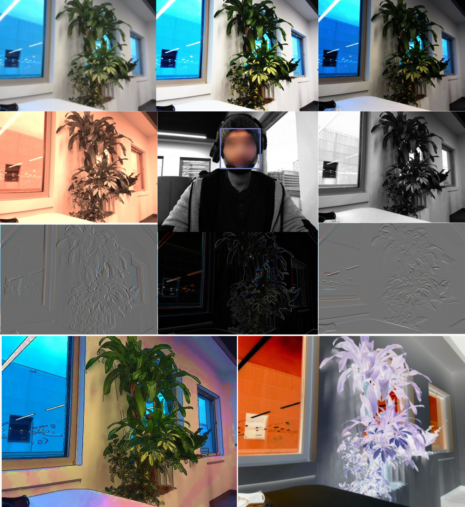

# image-processing-hello-world
This project introduces image processing fundamentals and applications along with their implementations in C++ using OpenCV.

## setup:

### key features:

- Windows 11, WSL, Docker, Flask, X11 screen

### requirements: 
- docker desktop version : v4.22.1
- docker version : 24.0.5
- (WSL) Ubuntu-22.04

Steps:
- Follow this tutorial to get the docker image up and running. : <a href="https://firstcaptain.github.io/opencv-docker/">tutorial link</a>
- Follow this tutorial to setup a http stream for your webcam. : <a href="https://www.youtube.com/watch?v=HuzXh-Xcgyk&t=7s"> tutorial link </a> The changes in this pull request has to be made <a href="https://github.com/freedomwebtech/webcaminnetwork/pull/1">. PR link </a>. 

## contents:

- colour to grayscale function OpenCV.
- Custom colour to grayscale function.
- Sepia tone filter.
- Increase contrast using 'normalized squaring' method.
- Increase contrast using 'shifted and scaled sigmoid' method. 
- Applying Gaussian filter naively (element wise operations) (inefficent).
- Applying Gaussian filter relatively efficiently (slice operations).
- Sobel X using seperated filters.
- Sobel Y using seperated filters.
- Magnitude of gradiant using the Sobel filters.
- Blurring and Quantize the channels values into 10 bins. (color binning to #bins**3 colors)
- Detect faces in the video stream.
- Detect faces in the video stream and blurr the background.
- Detect faces in the video stream and convert the background to grayscale.
- Make negative.
- Cartoonize the video feed. (Comic style) (Increase saturation + Bilateral filtering + Canny edges + contour detection and drawing).

## Sample outputs

## references

[1] <a href="https://www.learncpp.com/">https://www.learncpp.com/</a>.\
[2] <a href="https://docs.opencv.org/4.x/modules.html">OpenCV Documentation</a>.\
[3] <a href="https://cs.colby.edu/maxwell/courses/tutorials/maketutor/">Makefile tutorial</a>.\
[4] Winnemoeller. H., Real-time video abstraction., ACM Transactions on Graphics., July 2006.\
[5] <a href="https://firstcaptain.github.io/opencv-docker/">Docker image</a>.\
[6] <a href="https://github.com/freedomwebtech/webcaminnetwork">http stream of webcam</a>.\